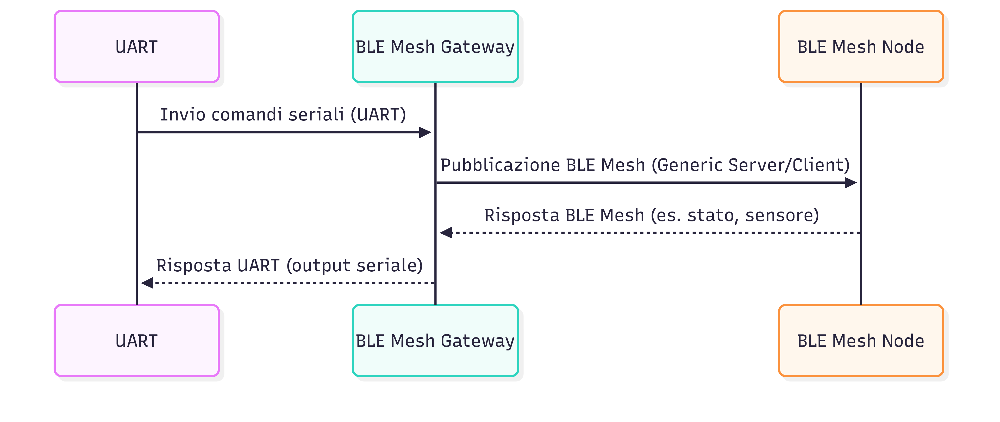

# Neodelis BLE Mesh Test Device

## Testing Environment

1. Prerequisiti per avviare l'ambiente di svilppo:

   - clonare la repository di Espressif: https://github.com/espressif/esp-idf
   - assicurarsi di aver eseguito ". ./esp/esp-idf/export.sh" nel terminale di lavoro corrente

2. Una volta eseguito quanto sopra, clonare questo progetto in una cartella, ed assicurarsi di copiare le cartelle components/ e tools/ da /esp/esp-idf/ nella directory del progetto, per ottenere un direttorio del tipo:

```ini
project-neodelis-ecolumiere-meshtestdevice/
├── components/
├── sensor_server/
├── tools/
└── README.md
```

3. Assicurati che il comando "idf.py" lanciato da terminale non dia errore (in caso ripetere punto 2 dei prerequisiti). Fatto ciò entra nella cartella sensor_server/ e lancia "idf.py menuconfig"

4. Nel pannello appena aperto, assicurarsi che le seguenti opzioni siano attivate:

   - Component config --> ESP BLE Mesh Support --> (*) Support for BLE Mesh Node
   - Component config --> ESP BLE Mesh Support --> Support for BLE Mesh Client/Server models --> (*) Sensor Server model
   - Component config --> ESP BLE Mesh Support --> Support for BLE Mesh Client/Server models --> (*) Lighting Server models

   Adesso uscire (q) e salvare (y).

5. Lanciare "idf.py set-target esp32" per impostare il tipo di scheda con cui si vuole lavorare.

6. Lanciare "idf.py build" per compilare il progetto, ed infine "idf.py -p PORTASERIALE flash monitor" per flashare i binari alla scheda. Esempio di PORTASERIALE è /dev/ttyUSB0.
   Usare la combinazione "Ctrl + AltGr + ]" per uscire dal monitor seriale appena aperto.

## Funzionamento

Tutti i codici op sono standard Bluetooth Mesh BLE. Attenersi alla lista [Mesh Model Message Opcodes](https://www.bluetooth.com/wp-content/uploads/Files/Specification/Assigned_Numbers.html#bookmark141) ufficiale.

### Sensori

Si ricorda che i valori di temperatura e potenza dissipata sono fittizi e impostati a priori dal programmatore, in quanto ambiente di sviluppo.
Si notino le assegnazioni di `indoor_temp = 40` e `potenza_istantanea_assorbita = 2410`.
Quest'ultima, in particolare, verrà divisa per 100 in fase di elaborazione dal gateway, di modo che il nodo possa lavorare più agevolmente con semplici interi (quindi il valore reale visto nel DB sarà 24.10 W).

Al momento, sono integrati tre tipi di dati sensoriali:

- Temperatura indoor (0x0056)
- Potenza istantanea dissipata (0x025d)
- Qualità del segnale (ricavata dal gateway tramite RSSI)
- Hop effettuati (ricavati dal gateway tramite TTL)

Ad una richiesta con opcode `ESP_BLE_MESH_MODEL_OP_SENSOR_GET` (0x8231) cadenzata dal gateway ogni SENSOR_TIME secondi, il nodo risponde con un pacchetto di opcode `ESP_BLE_MESH_MODEL_OP_SENSOR_STATUS` (0x52) contente i dati dei sensori.

Il gateway riceverà informazioni del tipo:

```sh
 ADDR          RSSI         TTL         ID_S1   S1_DATA     ID_S2      S2_DATA
0x0005      0xffffffe1     0x0007      0x0056     28        0x025d      6A09 
```

Nel caso della potenza assorbita, notare che i dati sensoriali sono riportati in big endian.

### Luce

Il nodo accetta comandi per:

- Modificare il colore e la luminosità della luce in HSL: `ESP_BLE_MESH_MODEL_OP_LIGHT_HSL_SET` (0x8276)

Una volta aggiornata la lampada con le impostazioni appena inviate, il nodo risponderà rispettivamente con

- `ESP_BLE_MESH_MODEL_OP_LIGHT_HSL_STATUS` (0x8278)

### Integrazione con il gateway

Una volta alimentata la scheda, essa aspetterà il proprio provisioning, da parte del gateway. Una volta completato, si avvierà il timer del gateway citato sopra, per l'acquisizione dei dati sensoriali.
Rimarrà quindi in ascolto di evenutuali comandi di SET.

Questi comandi sono impartiti dal gateway, a cui, a sua volta, vengono inoltrati via UART da un altro processore, che andrà a consulatre il database. Si può osservare il seguente schema per avere un'idea complessiva del sistema.



Un esempio di comando inviato via UART può essere `hsl 12 34 56`, che il gateway interpreterà come invio di opcode 0x8276 con valori 12, 34, 56. In futuro il comando prenderà la forma di `hsl 0x1234 12 34 56`, per una rete con molteplici nodi.

## SPECIFICHE SISTEMA ECOLUMIERE MESH

Le lampade intelligenti all’interno di un sistema Ecolumiere Mesh presentano parametri fondamentali per il monitoraggio e la gestione. Questi parametri possono essere suddivisi in caratteristiche fisiche, prestazioni energetiche, condizioni ambientali, interazione con l’utente e manutenzione. Le lampade sfruttano la tecnologia Bluetooth Mesh, in cui i nodi (lampade) sono collegati a un gateway che funge da ponte tra la rete Bluetooth e quella Wi-Fi.

### Caratteristiche dei nodi

- I nodi non devono essere distanti più di 10 metri l’uno dall’altro, preferibilmente senza ostacoli intermedi.
- I nodi che aggregano altri nodi vengono elevati a relay node, creando una gerarchia all’interno della rete. Ad esempio, i nodi dei corridoi o delle scale possono diventare relay node, mentre quelli delle stanze restano nodi semplici. Se la comunicazione diretta tra alcuni nodi viene interrotta, il relay node garantisce l’inoltro corretto dei messaggi, mantenendo la continuità della rete Bluetooth Mesh.

### Informazioni raccolte dal gateway

Il gateway raccoglie i seguenti dati per ciascun nodo:
- #### ID:
  - identificativo univoco della lampada
- #### Caratteristiche fisiche
  - **Stato ON/OFF**
  - **Intensità luminosa** (lumen)
  - **Temperatura del colore**: luce bianca calda (~2500K) o bianca fredda (~6500K)
  - **Colori della luce**: bianca o RGB; in caso RGB indicare il colore attuale
  - **Durata di accensione** e spegnimento: tempo totale (in ore/minuti) durante il quale la lampada è rimasta accesa o spenta.
  - **Posizione del nodo**: identificazione alfanumerica basata sulla planimetria, comprendente stabile, piano, stanza e numero progressivo della lampada (Es: S1–P3–S5–L14 indica Stabile 1, Piano 3, Stanza 5, Lampada 14). La numerazione di ciascun elemento dovrebbe essere definita in fase di stesura della planimetria
- `Prestazioni energetiche`
  - **Consumo giornaliero di potenza** (W)
  - **Efficienza energetica**: rapporto tra luminosità emessa e potenza consumata
  - **Tensione e corrente**: parametri di stabilità ed efficienza dell’alimentatore
  - **Energia residua**: utile per valutare la disponibilità complessiva del sistema
  - **Frequenza di accensione e spegnimento**: consente di capire quando la lampada è effettivamente in uso
- Condizioni ambientali
  - **Temperatura** (°C): monitorare eventuali surriscaldamenti
  - **Umidità**
  - **Pressione atmosferica**: ottenere informazioni ambientali a più ampio spettro
- Interazione e controlli
  - **Controllo remoto**: verifica se la lampada è stata monitorata tramite APP e registra l’ultimo accesso
  - **Sincronizzazione**: tiene traccia dello stato della rete e dei dispositivi vicini
  - **Giorni programmati**: possibilità di programmare accensione, spegnimento e intensità luminosa della lampada in base a giorni e orari
- Connettività
  - **Ultima connessione**: registra orario, qualità e intensità del segnale, numero di hop necessari
  - **Stato online** della lampada rispetto al gateway
  - **Qualità e intensità del segnale**
  - **Numero di hop** necessari per raggiungere la destinazione
  - **Tipo di protocollo** utilizzato
- Manutenzione
  - **Ore di vita** dei led
  - **Guasti**: cortocircuiti o sovraccarichi
  - **Reset**: verifica eventuali reset della lampada, aggiornamenti firmware e orario dell’ultimo aggiornamento
- Funzioni extra
  - **Sensore di movimento**: rileva la presenza di persone in una stanza e lo stato di funzionamento
  - **Sensore di luce**: rileva e riporta i valori luminosi ambientali
  - **Illuminazione intelligente**: autoregolazione del sistema in base alle condizioni ambientali e alle impostazioni di programmazione
### Scansione dei nodi
Si consiglia di eseguire la scansione dei nodi due volte al giorno, al mattino e alla sera, corrispondenti all’apertura e alla chiusura dell’azienda. Il gateway verifica quali nodi hanno risposto alle richieste inviate e genera un report. Se qualche lampada non risponde, confronta l’elenco dei nodi programmati con quelli che hanno risposto e invia un alert all’app per segnalare eventuali mancanze. Un singolo gateway può gestire fino a circa 30.000 nodi all’interno di una rete.
